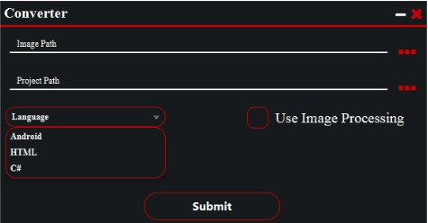

# Sketch Builder (Runner)

sketch builder is an application that use AI and computer Vision technologies to convert design sketch to real code in multiple programming languages.

## Getting Started

These instructions will get you a copy of the project up and running on your local machine for development and testing purposes:

### Prerequisites

- Linux System (ubuntu, debian are tested)
- gcc compiler(build version 8.3.0)
- java jdk 8 "set JAVA_HOME environment variable to your jdk8 home directory"
- cmake build tool
- opencv library
- boost library
- git tool

* all prerequisites are mandatory to successful build


### Installing

- open your terminal and write the following commands

```
$ git clone https://github.com/zezomousa101/Sketch-Builder.git
$ cd Sketch-Builder
$ ./installer.sh
```

- Now let the magic happens.


## How to use the application

- after installation sucess do this command

```
$ cd bin
$ ./runner
```

### Screenshots

<p align="center"></p>
<p align="center"></p>
<p align="center"></p>

### Project Parts:

- [Compiler] (https://github.com/zezomousa101/compiler)
- [Equalizer] (https://github.com/zezomousa101/equalizer)
- [Generator] (https://github.com/hatematef07/SketchBuilderCodeGenerator)
- [UI] (https://github.com/Alaa-Yasser/Sketch-Builder-UI)
- [Server] (https://github.com/zezomousa101/Sketch_builder_server)
